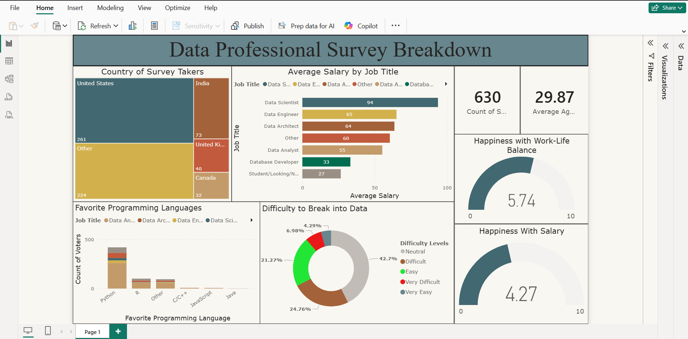

# Data Professionals Survey Breakdown (Power BI)

## Overview

This Power BI dashboard analyzes survey responses from data professionals to uncover trends in salaries, programming preferences, demographics, and career satisfaction.

## Dashboard Features

* Average Salary by Job Title
* Country-wise Survey Distribution
* Favorite Programming Languages
* Work-Life Balance Analysis
* Salary Satisfaction Metrics
* Difficulty Breaking into Data Careers

## Tools Used

* Power BI Desktop
* Power Query
* DAX
* Data Visualization

## Key Insights

* Data Scientists reported the highest average salary.
* Python was the most preferred programming language.
* Work-life balance satisfaction exceeded salary satisfaction.
* Survey respondents came from multiple countries.

## Dashboard Preview

## Files

* Project Survey.pdf → Dashboard Export
* Dataset → Survey dataset

## Author

Neeraj Singh Bisht
